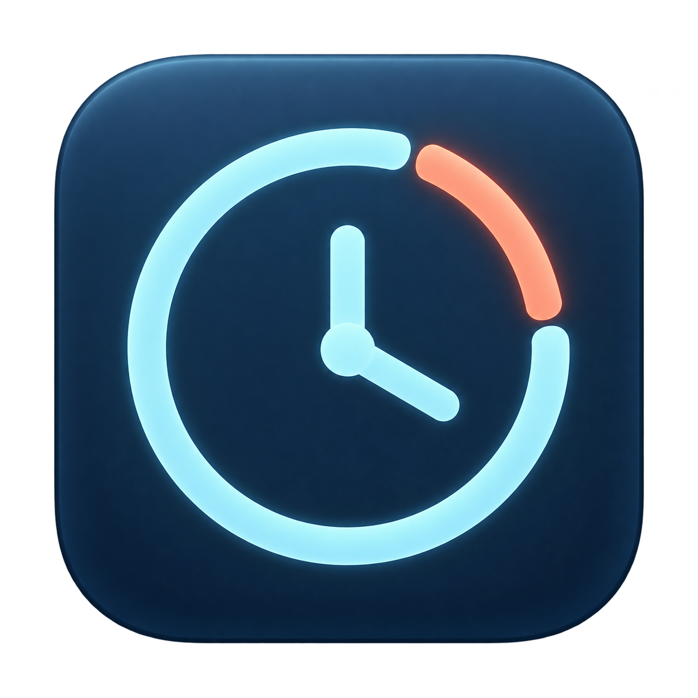
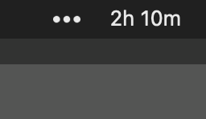

# Activity Tracker for Mac



A small macOS menu-bar app that tracks your active computer time. Built with Go as a focused alternative to Screen Time.

Inspired by [timeow](https://github.com/f-person/timeow-mac) 🙏

## 📷 Screenshot



## 🤔 Why Another Activity Tracker?

This project focuses on one thing: tracking computer activity time without the complexity of a full Screen Time dashboard.

## ✨ Features

- Lives quietly in your menu bar
- Monitors computer activity and idle time with precision
- Built with native Go libraries for optimal performance
- Simple by design - no bloat, no unnecessary features

## 📥 Install

Download the DMG from the [latest release](https://github.com/mguellsegarra/activity-tracker-mac/releases/latest), open it, and drag **Activity Tracker.app** to **Applications**. Launch the app from Applications; its counter appears in the menu bar.

The DMG is ad-hoc signed but **not notarized** by Apple. macOS may ask you to confirm that you want to open a downloaded app. Only install it if you trust this repository and the release you downloaded.

Activity data is stored at `~/.config/activity_tracker/active_time` and is kept when upgrading the app.

## 🔧 Build from source

- Go 1.22.2 or higher
- macOS
- ImageMagick (only to regenerate the icon or build the DMG)

1. Clone the repository:
```bash
git clone https://github.com/mguellsegarra/activity-tracker-mac.git
cd activity-tracker-mac
```

2. Install dependencies:
```bash
go mod download
```

3. Build the macOS app:
```bash
./scripts/build-app.sh
```

The source icon is `Resources/AppIcon.png`; its bundled macOS version is
`Resources/AppIcon.icns`. To regenerate the latter, run `./scripts/build-icon.sh`.

To build a drag-to-Applications DMG:
```bash
./scripts/build-dmg.sh
```

The disk image is saved as `build/Activity-Tracker.dmg`.

## 🚀 Usage

Copy the built app to `/Applications`, then open it:
```bash
ditto "build/Activity Tracker.app" "/Applications/Activity Tracker.app"
open "/Applications/Activity Tracker.app"
```

The application will appear in your menu bar.

For development without an app bundle, `go run .` still works, but menu bar managers
on macOS 27 may not recognize an executable launched outside `/Applications`.

## ⚙️ Adding to macOS Startup

To start the installed app automatically, add **Activity Tracker.app** in System
Settings → General → Login Items & Extensions. If you previously installed the
Launch Agent from older instructions, unload or disable it first so two copies
do not track and write the same activity file.

## 🤝 Contributing

Contributions are welcome! Please feel free to submit a Pull Request.

If you find this extension useful, please consider:

- ⭐ Starring the repository
- 🐛 Reporting any bugs you find
- 💡 Suggesting new features

## 📄 License

This project is licensed under the [**MIT License**](https://github.com/mguellsegarra/activity-tracker-mac/blob/main/LICENSE).

## 👋 Author

I'm Marc Güell Segarra, a freelance software developer at [Ondori.dev](https://ondori.dev).

## ☕ Buy Me a Coffee

If you found this extension useful, consider **[buying me a coffee](https://buymeacoffee.com/mguellsegarra)!**
