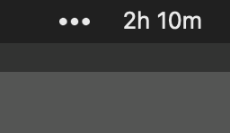

# Activity Tracker for Mac

A simple, focused system tray application that tracks your computer activity, built with Go. Created out of frustration with macOS's native Screen Time feature, which has proven to be unreliable and problematic.

Inspired by [timeow](https://github.com/f-person/timeow-mac) 🙏

## 📷 Screenshot



## 🤔 Why Another Activity Tracker?

This project exists because the native macOS Screen Time tracking is fundamentally broken - it often fails to track activity correctly, provides inconsistent data, and is overly complex. Instead of trying to do everything, this application does one thing and does it well: tracking your actual computer activity time accurately and reliably.

## ✨ Features

- Lives quietly in your system tray
- Monitors computer activity and idle time with precision
- Built with native Go libraries for optimal performance
- Simple by design - no bloat, no unnecessary features

## 🔧 Prerequisites

- Go 1.22.2 or higher
- macOS

## 📥 Installation

1. Clone the repository:
```bash
git clone https://github.com/yourusername/activity_tracker.git
cd activity_tracker
```

2. Install dependencies:
```bash
go mod download
```

3. Build the application:
```bash
go build
```

## 🚀 Usage

Run the application:
```bash
./activity_tracker
```

The application will appear in your system tray.

## ⚙️ Adding to macOS Startup

To make the activity tracker start automatically when you log in to your Mac:

1. Create a Launch Agent:
   ```bash
   mkdir -p ~/Library/LaunchAgents
   ```

2. Create a new file named `com.user.activity_tracker.plist` in the LaunchAgents directory with the following content (replace the path with your actual build path):
   ```xml
   <?xml version="1.0" encoding="UTF-8"?>
   <!DOCTYPE plist PUBLIC "-//Apple//DTD PLIST 1.0//EN" "http://www.apple.com/DTDs/PropertyList-1.0.dtd">
   <plist version="1.0">
   <dict>
       <key>Label</key>
       <string>com.user.activity_tracker</string>
       <key>ProgramArguments</key>
       <array>
           <string>/path/to/your/activity_tracker</string>
       </array>
       <key>RunAtLoad</key>
       <true/>
       <key>KeepAlive</key>
       <true/>
   </dict>
   </plist>
   ```

3. Load the Launch Agent:
   ```bash
   launchctl load ~/Library/LaunchAgents/com.user.activity_tracker.plist
   ```

Alternatively, you can also add the application to your Login Items:

1. Open System Settings
2. Go to General > Login Items
3. Click the '+' button
4. Navigate to and select your activity_tracker executable
5. The application will now start automatically when you log in

## 🤝 Contributing

Contributions are welcome! Please feel free to submit a Pull Request.

If you find this extension useful, please consider:

- ⭐ Starring the repository
- 🐛 Reporting any bugs you find
- 💡 Suggesting new features

## 📄 License

This project is licensed under the [**MIT License**](https://github.com/mguellsegarra/activity-tracker-mac/blob/main/LICENSE).

## 👋 Author

I'm Marc Güell Segarra, a freelance software developer at [Ondori.dev](https://ondori.dev).

## ☕ Buy Me a Coffee

If you found this extension useful, consider **[buying me a coffee](https://buymeacoffee.com/mguellsegarra)!**
